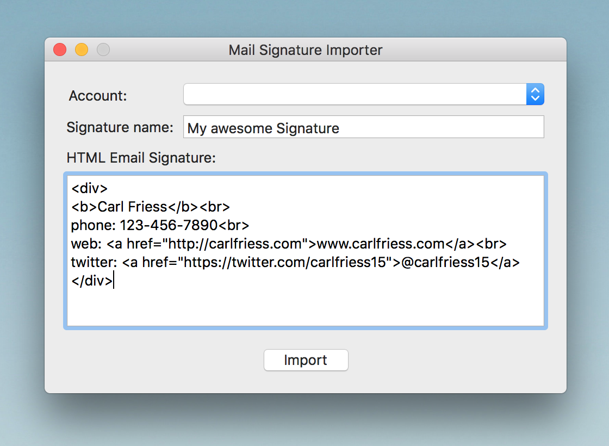

# Apple Mail Signature Importer

Easily import HTML email signatures into the Apple Mail email client. Just choose an account and name, then paste your HTML code and click 'Import'. You'll need to quit and reopen Mail after you are done. You can view all installed signatures in `Mail` > `Preferences...` > `Signatures`.

<b><a href="https://raw.githubusercontent.com/carlfriess/mail-signature-importer/master/Mail Signature Importer.zip">Download</a></b>

I've tested this on several systems. It worked. However, don't blame me if it doesn't work for you. You can backup `~/Library/Mail/` before using this app.
